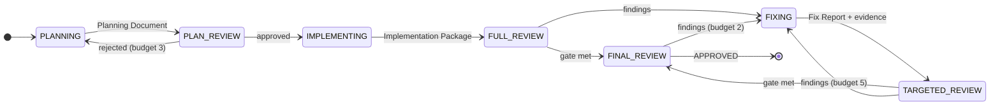
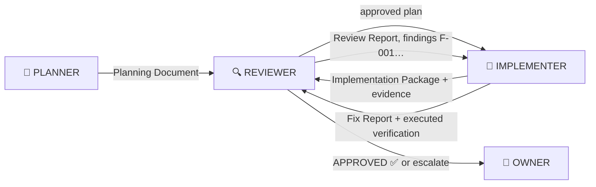

<h1 align="center">🔥 Heatwave</h1>

<p align="center">
  <em>A verification protocol for AI-written code. Plan, build, review, prove — in a loop that never silently restarts.</em>
</p>

<p align="center">
  
  
  
  
</p>

---

AI coding agents are fast and confident — and confidently wrong. They review their own work and approve it. They claim "all tests pass" without running them. And when a session dies mid-task, the next one cheerfully starts over from scratch, throwing away the approved plan and the reviewed code.

**Heatwave** fixes all three, with nothing but markdown and a folder:

| Failure | Heatwave's answer |
|---|---|
| 🪞 **Self-review** — the author grades its own homework | Three isolated AI roles (PLANNER · IMPLEMENTER · REVIEWER). No context ever evaluates its own output. |
| 🗣️ **Asserted verification** — "verified ✅" with no method, no output | Evidence or it didn't happen. A claim of verification without attached evidence is an automatic Blocker. |
| 🔁 **The random restart** — a new session re-plans, re-implements, resets everything | Run state lives on disk. Any session, in any tool, resumes the loop exactly where it stopped. |

It is a **specification, not a service**: no server, no SDK, no API keys, no vendor lock-in. If your AI tool can read files, it can run Heatwave.

## How it works

Every task walks one state machine. Each state is owned by exactly one role, and each transition produces an artifact file — the plan, the review, the fix evidence — that the next role consumes.



**The gate is simple and absolute:** zero open Blockers, zero open Majors. The REVIEWER — never the implementer — decides severity and what may be deferred. Every loop has an iteration budget; when one runs out, the protocol escalates to you (the human OWNER) with a report ending in one specific, answerable question. You decide, counters reset, the loop resumes. Nothing is terminal except `APPROVED` and `ABANDONED`.

### The three roles (and you)

| Role | Played by | Owns |
|---|---|---|
| 🧠 **PLANNER** | an AI context | What to build and how — the Planning Document, acceptance criteria, review scope |
| 🔨 **IMPLEMENTER** | a *different* AI context | The code, the tests, the evidence — under the [ponytail](#-ponytail-built-in) minimalism discipline |
| 🔍 **REVIEWER** | a *different* AI context | Whether it's correct and complete — findings, severity, deferrals, final approval |
| 👤 **OWNER** | you | Escalations, waivers, everything the roles can't resolve |

The isolation boundary is the **context, not the model** — one model can play all three roles from fresh contexts. The REVIEWER receives artifacts, never transcripts, so it judges what was *produced*, not what was *intended*. And roles talk only through files:



### The loop that never restarts

Everything a run produces lives in your repo, so **the filesystem — not any session's memory — is the source of truth**:

```
.heatwave/runs/2026-07-18-add-export/
├── state.yaml                    ← current state + counters: the resume anchor
├── run-record.yaml               ← append-only audit trail
├── 01-planning-document.md
├── 02-plan-review-1.md           ← approved
├── 03-implementation-package.md
├── 04-review-report-1.md         ← 2 Majors found
├── 05-fix-report-1.md            ← fixes, with executed verification output
└── ...
```

Kill your terminal after artifact 05. Tomorrow, in a new session — even in a *different tool* — say "continue the export feature." The driver reads `state.yaml`, sees `TARGETED_REVIEW`, and dispatches a reviewer with artifacts 01–05. Nothing is re-planned, nothing re-implemented, no counter reset. The resume rule (R-88) makes restarting a protocol violation, not an accident. Deep dive: [docs/loop.md](docs/loop.md).

### Evidence, not assertion

The protocol's sharpest teeth, in three rules:

- Every review finding states an **executable verification method** ("run `suite::test`, expect pass" — not "retest the flow").
- The implementer must **execute that method and attach the real output** to mark a finding fixed.
- A role that claims verification it did not perform has committed a **Blocker** — the same severity as shipping a data-loss bug. If a tool isn't available (no simulator, no load-test rig), the protocol forces the honest sentence: *this criterion is unverified*, and unverified criteria block approval until you explicitly waive them.

### Right-sized ceremony

A one-line copy fix doesn't need a rollout plan. Three tiers (§0.5) scale the paperwork while keeping every gate:

| Tier | For | Planning Document | Reviews |
|---|---|---|---|
| **LIGHT** | one-file fixes, copy, config | 4 sections | plan review, then one combined code+final review |
| **STANDARD** | a normal feature or bugfix | all sections, N/A allowed | full state machine |
| **FULL** | migrations, auth, money, user data | everything, no shortcuts | full machine + item-by-item readiness checklist |

## 🚀 Quickstart

```sh
git clone https://github.com/abhirajsinha/heatwave.git
cd heatwave
./install.sh /path/to/your/project claude   # or: codex | gemini | cursor | generic
```

The installer drops `.heatwave/` (protocol, prompts, templates, ponytail) into your project, wires up the adapter for your tool, and creates `heatwave.config.yaml` — edit that once to declare your models and which test tooling actually exists in your project. It's idempotent: re-run it anytime to update; it never touches your config or your runs.

Then just ask your agent to build something:

> *"Add CSV export to the reports page."*

The agent enters `PLANNING`, and the loop takes it from there. You'll be pulled in only when the protocol needs a human: an approval you've configured, an escalation, or a waiver.

## 🤖 Works with every AI coding tool

Heatwave is pure markdown + a shell script. Adapters put the rules where each tool reads its standing instructions:

| Tool | Adapter installs | How role isolation works |
|---|---|---|
| **Claude Code** | `CLAUDE.md` block + three subagents (`.claude/agents/`) | The session is the driver; each role runs as a **fresh subagent** — true isolation inside one session |
| **Codex** | `AGENTS.md` block | Each role is a fresh session; the run directory carries state between them |
| **Gemini CLI** | `GEMINI.md` block | Same sequential-session driver |
| **Cursor** | `.cursor/rules/heatwave.mdc` (always-on rule) | Same sequential-session driver |
| **Anything else** | `.heatwave/HEATWAVE-AGENT.md` — paste into your tool's system prompt or rules file | Works with any agent that can read and write files |

Different tools can even share one run: plan with Claude Code today, review with Gemini tomorrow — the artifacts on disk are the interface.

## 🦥 Ponytail, built in

Verification pressure has a side effect: implementers gold-plate. Heatwave counters it by bundling **[Ponytail](https://github.com/DietrichGebert/ponytail)** (MIT, © Dietrich Gebert — vendored with attribution in [`plugins/ponytail/`](plugins/ponytail/)), the lazy-senior-dev discipline, bound to the IMPLEMENTER role:

> Does this need to exist? → Is it already in the codebase? → Stdlib? → Native platform feature? → Existing dependency? → One line? → *Only then* write the minimum code that works.

The result: the shortest diff that meets the acceptance criteria — which is also the cheapest diff to review honestly. The reviewer's bar is untouched ("lazy" never means unverified), and over-engineering is itself a reviewable finding. Deliberate shortcuts get a `ponytail:` comment naming the ceiling, and each one lands in the Implementation Package's Known Limitations for the reviewer to judge.

## 📦 What's in the box

```
heatwave/
├── PROTOCOL.md                  # the full specification (v3.1) — the source of truth
├── install.sh                   # one-command install into any project
├── heatwave.config.example.yaml # models per role, budgets, your project's real tooling
├── prompts/                     # ready-to-use prompt per role & state (driver, planner,
│                                #   plan-reviewer, implementer, reviewer, fixer, final-reviewer)
├── templates/                   # every artifact: planning doc, implementation package,
│                                #   review report, fix report, escalation report, run record
├── adapters/                    # claude-code / codex / gemini / cursor / generic
├── plugins/ponytail/            # vendored ponytail skill + license + attribution
└── docs/                        # loop.md (persistence deep-dive) · faq.md
```

## 📖 Learn more

- **[PROTOCOL.md](PROTOCOL.md)** — the full spec: 96 numbered rules, each with the failure it exists to prevent, written to be read by humans and enforced on AIs.
- **[docs/loop.md](docs/loop.md)** — anatomy of a run, the resume rule, crash edge cases.
- **[docs/faq.md](docs/faq.md)** — one model? too much ceremony? what stops the AI from cheating?

## License

MIT © Abhiraj Sinha. Vendored Ponytail skill MIT © Dietrich Gebert ([attribution](plugins/ponytail/ATTRIBUTION.md)).

---

<p align="center"><sub>Heatwave grew out of a real production workflow for shipping AI-built apps, hardened over three protocol versions. The failure modes it guards against are ones we hit, not ones we imagined.</sub></p>
