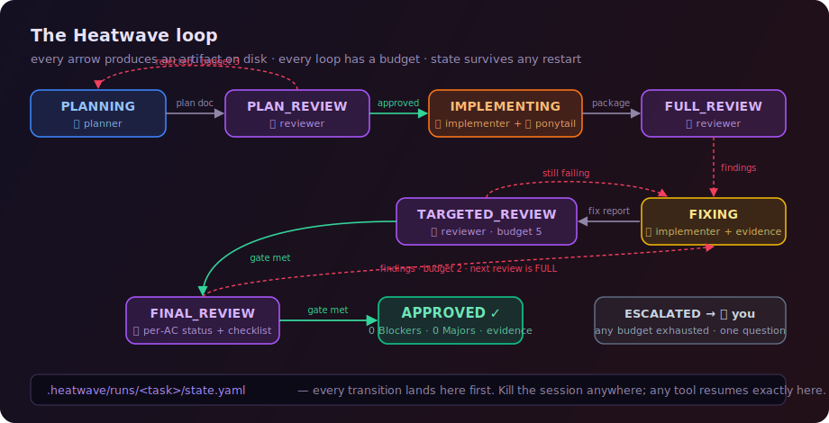

<p align="center">
  
</p>

<p align="center">
  
  
  
</p>

## What is this?

Heatwave makes your AI coding agent **prove its work** instead of just claiming it.

You ask for a feature the way you always do. Behind the scenes, the work is split between three separate AI roles — one plans, one builds, one reviews — and nothing ships until the reviewer approves it with real evidence. Everything is tracked in plain files inside your repo, so the work can never be silently lost or restarted.

It works with **Claude Code, Codex, Gemini CLI, Cursor, and any other coding agent**. No server, no API keys, no dependencies — just markdown files and one install script.

## Why you'd want it

AI coding agents have three bad habits:

1. **They review their own work** — and approve it. The author's blind spots inspect the author's blind spots.
2. **They say "verified ✅" without verifying.** Ask if it tested everything and you get a confident story, not evidence.
3. **They start over when a session dies.** Yesterday's approved plan and reviewed code? A new session happily redoes it all.

Heatwave fixes all three: separate roles that never grade their own work, a hard rule that every claim needs attached evidence, and progress saved to disk after every step so any session — even in a different tool — continues exactly where the last one stopped.

## How a task actually runs

Say you ask: *"Add CSV export to the reports page."*

<p align="center">
  
</p>

1. **🧠 Plan** — a planner writes down what will be built: the exact acceptance criteria, what gets reviewed, what gets tested and with which tools.
2. **🔍 Plan review** — a *different* AI context judges that plan. Weak criteria, contradictions, missing edge cases? Rejected, revised, re-reviewed. **No code exists yet.**
3. **🔨 Build** — only after the plan passes, an implementer writes the code — the *smallest* code that meets the criteria (a bundled discipline called [ponytail](https://github.com/DietrichGebert/ponytail) keeps it from over-building).
4. **🔍 Review & fix** — the reviewer checks the code against the plan and files findings. The implementer must fix each one **and attach proof the fix works** (real test output, not promises). This loops until zero serious findings remain.
5. **✅ Approved** — a final review confirms every acceptance criterion with evidence. Done means *proven done*.

Want to see every command and every file this produces for a real task? **[Read the complete worked example →](docs/example.md)**

**It runs without stopping.** The loop only interrupts you for three things: it finished, it's stuck and needs one specific decision from you, or a choice only a human may make (like waiving a security finding). No "shall I continue?" every five minutes.

**And it never loses progress.** Every step is saved to `.heatwave/runs/<task>/` in your repo *before* the next step starts. Kill the terminal, let the laptop sleep, come back next week, even switch from Claude Code to Gemini — say "continue the export feature" and it picks up at the exact step it stopped. Starting over is against the rules, literally.

<details>
<summary><strong>What the saved files look like</strong></summary>

```
.heatwave/runs/add-export/
├── state.yaml                    ← which step the task is on right now
├── run-record.yaml               ← audit trail of everything that happened
├── 01-planning-document.md       ← the plan
├── 02-plan-review-1.md           ← plan approved
├── 03-implementation-package.md  ← what was built + test results
├── 04-review-report-1.md         ← findings from review
└── 05-fix-report-1.md            ← fixes + proof they work
```

Everything is readable markdown. Check progress anytime: `cat .heatwave/runs/*/state.yaml`
</details>

<details>
<summary><strong>Doesn't this add a lot of overhead for small changes?</strong></summary>

<br>

No — ceremony scales with risk. A one-line fix runs a **LIGHT** version (a 4-section plan and one combined review). A normal feature runs the standard loop. Anything touching money, auth, or user data runs the **FULL** version with a production-readiness checklist. What never changes: the plan is reviewed before code, and claims need evidence.
</details>

## Setup (3 minutes)

**Step 1 — clone Heatwave** (anywhere, once):

```sh
git clone https://github.com/abhirajsinha/heatwave.git
```

**Step 2 — install it into your project**, picking your tool:

```sh
cd heatwave
./install.sh /path/to/your/project claude     # Claude Code
./install.sh /path/to/your/project codex      # Codex
./install.sh /path/to/your/project gemini     # Gemini CLI
./install.sh /path/to/your/project cursor     # Cursor
./install.sh /path/to/your/project generic    # anything else
```

<details>
<summary>What the installer does per tool</summary>

<br>

Every install puts the protocol, role prompts, and templates in `<project>/.heatwave/` and creates a `heatwave.config.yaml`.

- **Claude Code** — adds the rules to `CLAUDE.md`, three role subagents, and *enforcement hooks* that re-inject the rules on every prompt (so they can't fade mid-conversation). Also fetches the [ui-ux-pro-max](https://github.com/nextlevelbuilder/ui-ux-pro-max-skill) design skill so UI work meets a professional bar, and prints the official commands to add [ECC](https://github.com/affaan-m/ECC) security scanning and [claude-mem](https://github.com/thedotmack/claude-mem) cross-session memory.
- **Codex / Gemini CLI** — appends the rules to `AGENTS.md` / `GEMINI.md`.
- **Cursor** — adds an always-on rule in `.cursor/rules/`.
- **Generic** — gives you `.heatwave/HEATWAVE-AGENT.md` to paste into any tool's instructions.

Re-running the installer upgrades Heatwave's files and never touches your config or your task history.
</details>

**Step 3 — there is no step 3.** No config needed: every role runs on the model your session already uses, and your project's test tools (jest, vitest, pytest, playwright, go test, simulators…) are **auto-detected from the project itself** — the plan even cites the file that proves each tool exists. A `heatwave.config.yaml` full of commented-out overrides is created in case you ever want to pin something: different models per role, a tool detection can't see (like a load-test rig), or iOS/Android/both for mobile apps.

**That's it.** No new commands to learn — just ask your agent to build something. If it's real work, the loop starts automatically; casual questions and quick experiments stay casual.

## Good to know

- **One model is enough.** Roles are separated by *context*, not by model — the same model planning in one context and reviewing in a fresh one still can't grade its own work.
- **Works with your existing setup.** Skills, MCP servers, and plugins you already use make the roles stronger (design skills for UI criteria, browsers/simulators for real test evidence, security scanners for security review). None are required — a missing tool is honestly reported as "couldn't verify this," never papered over.
- **When it can't converge, it asks you well.** If reviews keep failing past a set budget, you get a short report ending in one specific question — you answer, and the loop resumes. No infinite loops, no vague "please advise."
- **It's honest about its limits.** This is enforcement by instructions, files, and hooks — strong, visible, auditable — not cryptographic. The [FAQ](docs/faq.md) covers what that means in practice.

## Learn more

| | |
|---|---|
| **[Complete example](docs/example.md)** | One real task, start to finish — every command you type and every file the loop produces |
| **[Getting started](docs/getting-started.md)** | Full walkthrough: install → config → first task → resuming → troubleshooting |
| **[The loop](docs/loop.md)** | How never-losing-progress works under the hood |
| **[FAQ](docs/faq.md)** | One model? Too much ceremony? What stops the AI from cheating? |
| **[PROTOCOL.md](PROTOCOL.md)** | The full specification — 101 numbered rules, each explaining the failure it prevents |
| **[Adapters](adapters/README.md)** | How to add support for a new AI tool (~20 lines) |

## License

MIT © Abhiraj Sinha · bundled [Ponytail](https://github.com/DietrichGebert/ponytail) skill MIT © Dietrich Gebert ([attribution](plugins/ponytail/ATTRIBUTION.md))

---

<p align="center"><sub>Heatwave grew out of a real production workflow for shipping AI-built apps, hardened over three protocol versions.<br>The failure modes it guards against are ones we hit — not ones we imagined.</sub></p>
